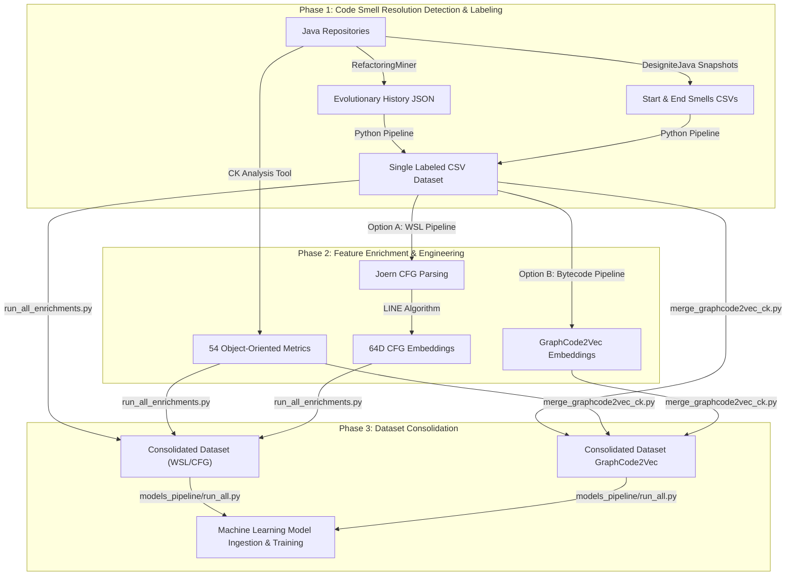
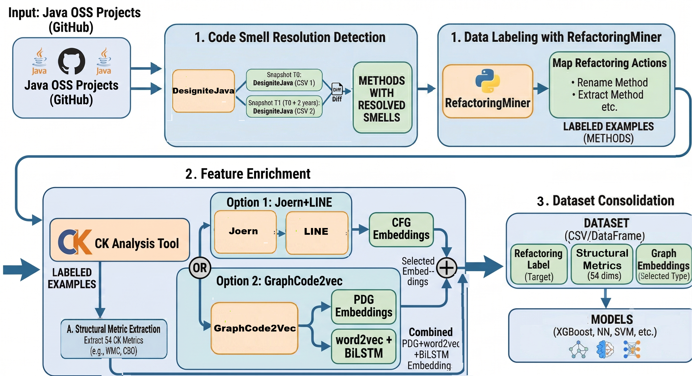

# Replication Package

This repository contains the replication package, referring to the Master's Thesis work: **"Integrating Structural and Semantic Analysis for Code Smell"** (Università degli Studi di Milano-Bicocca). 

This project implements a machine learning pipeline that handles the entire lifecycle from data extraction and feature engineering to model training and evaluation.

---

## 1. External Tools & Dependencies

To execute the entire data extraction and embedding pipeline, you must download and configure the following external tools. Please refer to their official repositories for installation guidelines:

* **RefactoringMiner (v3.0.x)**: Used to mine historical refactoring operations from Git commit histories.  
    [Official Repository & Download](https://github.com/tsantalis/RefactoringMiner)
* **DesigniteJava**: Used to extract traditional object-oriented metrics and detect implementation/design code smells from snapshots.  
    [Official Website & Download](https://www.designite-tools.com/designitejava)
* **CK Analysis Tool**: Used to calculate a comprehensive suite of 54 class-level and method-level object-oriented metrics.  
    [Official Repository & Download](https://github.com/mauricioaniche/ck)
* **Joern**: An open-source code analysis platform used in the Linux/WSL pipeline to parse source code into Control Flow Graphs (CFGs).  
    [Official Website & Installation](https://joern.io/)
* **GraphCode2Vec**: Used downstream at the compiler intermediate representation layer to generate joint syntactic and semantic bytecode embeddings.  
    [Official Repository & Guidelines](https://github.com/vinhsuhi/GraphCode2Vec)

---

## 2. Methodology Overview

The dataset construction and feature engineering framework follow a structured three-phase pipeline designed to align historical software evolution data with dense structural and syntactic representations.





## 2. Directory Structure

The codebase is organized into modular directories under `src/`:

```
project_thesis/
├── README.md
└── src/
    ├── core/               # Core execution scripts and processing logic
    ├── runners/            # Batch runners and automation scripts
    ├── utils/              # General helper and utility scripts
    └── models_pipeline/    # Machine learning training, tuning, and evaluation
```

### Core Execution Scripts ([src/core/])
- **[miner.py]**: Chronologically tracks class renames and movements across commits and maps refactoring interventions to smelly methods.
- **[evolution.py]**: Compares the initial and final snapshots and checks if smelly methods are resolved or persisted (smells still present in the "after" snapshot or refactored signature).
- **[labeller.py]**: Appends supervised labels (binary `0` or `1` fields) representing 10 refactoring categories to the Designite metrics dataset.
- **[ck_merger.py]**: Cleans and matches Designite methods with CK class-level and method-level metrics reports.
- **[enrich_embeddings.py]**: Fuzzy-merges datasets with CFG embeddings based on normalized class names and line number proximity.
- **[build_dataset.py]**: Scans Java files and integrates CodeBERT embeddings if enabled.
- **[merger.py]**: Combines labeled datasets and separates positive instances (rows with refactorings) from negative instances (zeros).
- **[merge_graphcode2vec_ck.py]**: Merges generated GraphCode2Vec embeddings with CK metrics.

### Utility Helpers ([src/utils/](file:///D:/papersEvolution/DesigniteJava/project_thesis/src/utils))
- **[ck_onefile.py]**: Merges all individual project CK files into a single master output CSV.
- **[meanPooling.py]**: Aggregates node-level embeddings to obtain method-level vectors.
- **[merge_csv.py]**: Simple helper to concatenate list-based csv data.
- **[features_classes.py]**,**[features_methods.py]**, **[features_smells.py]**, **[load_data.py]**, **[merge_features.py]**: Sub-modular feature engineering helpers used during initial dataset construction in `build_dataset.py`.

### Batch Runner & Automation Wrappers ([src/runners/](file:///D:/papersEvolution/DesigniteJava/project_thesis/src/runners))
- **[run_ck_analysis.py]**: Batch runs the CK tool jar over the projects to generate raw OO metrics reports.
- **[run_miner.py]**: Batch wrapper running `miner.py` across all project targets.
- **[run_evolution.py]**: Batch wrapper running `evolution.py` to compare before and after states.
- **[run_labeller.py]**: Batch wrapper executing the labeling process using `labeller.py`.
- **[run_ck_merger.py]**: Batch wrapper merging labeled features with CK metrics datasets.
- **[run_all_enrichments.py]**: Batch wrapper integrating CFG embeddings into the merged OO metric tables.
- **[wsl_pipeline.py]**: Automates the entire Linux/WSL execution flow (Joern parsing, CFG dot export, Scala metadata extraction, edge conversion, LINE node embedding training, and mean-pooling).
- **[run_designite_final.py]**: Automation script running the DesigniteJava tool jar to extract OO and code smell metrics.
- **[run_build_dataset_before.py]** / **[run_build_dataset_after.py]**: Batch wrappers running the initial metric dataset build pipeline.


### Machine Learning Pipeline ([src/models_pipeline/](file:///D:/papersEvolution/DesigniteJava/project_thesis/src/models_pipeline))
- **[pipeline.py]**: The core machine learning execution script that scales/balances datasets, trains LR/SVM/XGB/DNN models, performs Late Fusion stacking, runs ablation studies, applies Self-Supervised Learning (SSL), and plots calibration, ROC, UMAP, and SHAP outputs.
- **[run_all.py]**: Batch script executing `pipeline.py` sequentially across all 10 target refactorings.

---

## 3. Recommended Execution Order & Pipeline Execution Example

All runner scripts dynamically resolve paths relative to their locations, making them executable from any directory. To reproduce the study's data acquisition, features consolidation, and model evaluation, execute the scripts in the following order:

```
[Phase 1: Smells & Refactorings Extraction] ──> [Phase 2: CK Analysis & Labeling] ──> [Phase 3: Embeddings & Consolidation] ──> [Phase 4: ML Ingestion]
```

### Phase 1: Smells & Refactorings Extraction
Extract evolutionary refactorings and code smells, track their evolution across snapshots, and map them to build the base dataset:

1. **RefactoringMiner**:
   Extract historical refactoring operations (JSON files) from the target Git repositories. Depending on how you installed RefactoringMiner, you can run it using one of the following methods:
   ```bash
   # Method A: Running directly from source using the Gradle wrapper
   ./gradlew run -Pargs="-a /path/to/java-project-repo -json /path/to/output/project_refactorings.json"

   # Method B: Running via the binary distribution script (Linux/WSL)
   ./bin/RefactoringMiner -a /path/to/java-project-repo -json /path/to/output/project_refactorings.json

   # Method C: Running via the binary distribution script (Windows)
   bin\RefactoringMiner.bat -a \path\to\java-project-repo -json \path\to\output\project_refactorings.json
   ```
2. **Designite Metrics Extraction**:
   Extract traditional structural metrics and code smells from **two different snapshots** (the *before* and *after* versions/commits of the project). This process can be automated using:
   ```bash
   python src/runners/run_designite_final.py
   ```
3. **Build Dataset & Feature Engineering**:
   Format, merge, and clean the raw Designite CSV reports for both snapshots (with optional CodeBERT embedding generation) by running `build_dataset.py` for both the *before* and *after* project versions:
   ```bash
   # Run dataset builder for "before" snapshots
   python src/runners/run_build_dataset_before.py

   # Run dataset builder for "after" snapshots
   python src/runners/run_build_dataset_after.py
   ```
4. **Evaluate State Evolution**:
   Compare the *before* and *after* datasets generated in the previous step to trace which code smells were resolved and which persisted, obtaining the list of filtered smelly methods:
   ```bash
   python src/runners/run_evolution.py
   ```
5. **Mine & Match Refactorings**:
   Align the mined refactoring events with the filtered smelly methods obtained in the evolution step:
   ```bash
   python src/runners/run_miner.py
   ```

### Phase 2: CK Analysis & Labeling
Extract object-oriented metrics and apply target labels to create the supervised dataset:

1. **CK Analysis**:
   Extract 54 class-level and method-level object-oriented metrics across the projects:
   ```bash
   python src/runners/run_ck_analysis.py
   ```
2. **Generate Labels**:
   Apply supervised binary labels (`0` or `1`) representing the 10 target refactoring operations to the dataset:
   ```bash
   python src/runners/run_labeller.py
   ```

### Phase 3: Graph Embedding Generation & Consolidation
Generate the code embeddings and fuse them with structural metrics. You can choose one of the following two options depending on your setup:

#### Option A: WSL/Linux CFG Pipeline (CFG Embeddings)
Runs Joern CFG parsing, Scala metadata extraction, edge conversion, LINE node-embedding training, and mean-pooling, then merges the datasets:

1. **Execute WSL/Linux Script**:
   Generate the method-level CFG graph embeddings:
   ```bash
   # Execute in a Linux or WSL environment with Joern installed
   python src/runners/wsl_pipeline.py
   ```
2. **Merge Labeled Data with CK Metrics**:
   ```bash
   python src/runners/run_ck_merger.py
   ```
3. **Integrate CFG Embeddings**:
   Merge the generated CFG embeddings by performing a fuzzy join based on line number proximity:
   ```bash
   python src/runners/run_all_enrichments.py
   ```

#### Option B: GraphCode2Vec Bytecode Pipeline (GraphCode2Vec Embeddings)
Fuses class-level metrics and GraphCode2Vec semantic embeddings:

1. **Merge Labeled Data with CK Metrics**:
   ```bash
   python src/runners/run_ck_merger.py
   ```
2. **Integrate GraphCode2Vec Embeddings**:
   Run the dedicated merging script to fuse GraphCode2Vec embeddings with the consolidated CK metrics:
   ```bash
   python src/core/merge_graphcode2vec_ck.py --ck_file <path_to_ck_merged_csv> --embeddings_file <path_to_graphcode2vec_csv> --output_file <path_to_output_csv>
   ```

---

#### Final Dataset Merge & Split
After integrating embeddings and metrics for all individual projects (via Option A or Option B), you must merge all project CSV files into a global dataset and split them into positive and negative instances. Run `merger.py` on the directory containing your compiled project CSV files:
```bash
python src/core/merger.py --dir /path/to/enriched/csv/directory --out /path/to/output/dataset.csv
```
*This command will merge all project CSVs and output `dataset.csv` (containing positive rows with refactorings) and `dataset_zeros.csv` (containing negative rows with zeros), which are the exact files ingested by the machine learning pipeline in Phase 4.*

---

### Phase 4: Machine Learning Execution
Train, tune, and evaluate the classification models on the consolidated dataset:

1. **Run ML Pipelines Sequentially**:
   Execute the evaluation pipeline across all 10 target refactorings:
   ```bash
   python src/models_pipeline/run_all.py
   ```
   *This command runs Logistic Regression, SVM, XGBoost, and Deep Neural Networks (with Bayesian Tuning), evaluates Stacking Late Fusion, performs feature ablation studies, and generates visualization charts (ROC, Calibration curves, UMAP, SHAP) in the classification reports output folder.*
